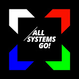

# All Systems Go & systemd

- systemd started in 2010.
- Fedora 15, released in May 2011.
- RHEL 7, released on June 10, 2014.
- 2015/16 systemd.conf
- 2017-19 23-25 All Systems Go! 

# The All Systems Go! conference

- youtube channel: <https://www.youtube.com/@AllSystemsGo>
- talks: <https://cfp.all-systems-go.io/all-systems-go-2025/schedule>
- systemd / user space / immutable
- 2 days /  150 attendees / ~50 talks [flickr](https://www.flickr.com/photos/139110107@N04/albums/)

## who are there?

- Company: Microsoft, RHEL, Meta
- Distro:
  - RHEL: fedora
  - Suse (container-snap/btrfs)
  - debian based:
    - GardenerLinux
    - SteamOS
  - ArchLinux 
  - others:
    - NixOS
    - ParticalOS
    - GnomeOS

## Hot topics
- mkiso box / ParticleOS
- systemd built-in functions
  - varlink (IPC)
  - systemd-homed
  -  systemd-sysext / systemd-confext
